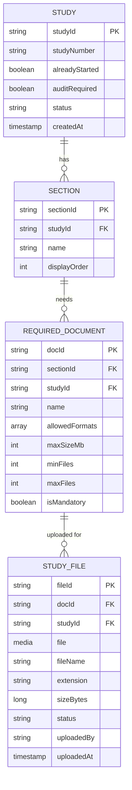

# Study Documents App: Palantir Foundry Build Guide

Beginner step-by-step guide for a Workshop app where users create studies, add sections per study, define required documents per section, and upload files (PDF, DOCX, XLSX only) against each required document.

Stack: Ontology Manager, Media sets, TypeScript v2 Functions, Actions, Workshop.

> Foundry menu labels change between versions. If a button name differs slightly, pick the closest match.

---

## 1. Model

### 1.1 Hierarchy

```
Study
 └── Section              (belongs to one study)
      └── RequiredDocument (belongs to one section)
           └── StudyFile   (uploaded file)
```

### 1.2 Diagram (Mermaid: renders in GitHub, GitLab, VS Code, Obsidian)



### 1.3 Object types

**Study**

| Property | Type | Notes |
|---|---|---|
| studyId | String | Primary key (UUID) |
| studyNumber | String | Title. Uppercase, alphanumeric, unique |
| alreadyStarted | Boolean | |
| auditRequired | Boolean | |
| status | String | `DRAFT` / `ACTIVE` / `CLOSED` |
| createdAt | Timestamp | |

**Section**

| Property | Type | Notes |
|---|---|---|
| sectionId | String | Primary key (UUID) |
| studyId | String | FK → Study |
| name | String | Title. Unique within the study |
| displayOrder | Integer | |

**RequiredDocument**

| Property | Type | Notes |
|---|---|---|
| docId | String | Primary key (UUID) |
| sectionId | String | FK → Section |
| studyId | String | Copied from section, for filtering |
| name | String | Title. Unique within the section |
| allowedFormats | String array | Values: `PDF`, `DOCX`, `XLSX` |
| maxSizeMb | Integer | |
| minFiles | Integer | |
| maxFiles | Integer | |
| isMandatory | Boolean | |

**StudyFile**

| Property | Type | Notes |
|---|---|---|
| fileId | String | Primary key (UUID) |
| docId | String | FK → RequiredDocument |
| studyId | String | Copied, for filtering |
| file | Media reference | Media set `study-files` |
| fileName | String | Title |
| extension | String | |
| sizeBytes | Long | |
| status | String | `ACTIVE` / `DELETED` |
| uploadedBy | String | |
| uploadedAt | Timestamp | |

### 1.4 Links (all one-to-many)

| From | To | Join | API names (from / to) |
|---|---|---|---|
| Study | Section | `Study.studyId = Section.studyId` | `sections` / `study` |
| Section | RequiredDocument | `Section.sectionId = RequiredDocument.sectionId` | `requiredDocuments` / `section` |
| RequiredDocument | StudyFile | `RequiredDocument.docId = StudyFile.docId` | `files` / `requiredDocument` |

### 1.5 Actions

| Action | Backing | Purpose |
|---|---|---|
| Create Study | Function `createStudy` | Validates and creates a study |
| Update Study | Modify object (no code) | Edit `alreadyStarted`, `auditRequired` |
| Add Section | Function `addSection` | Adds a section to a study |
| Add Required Document | Function `addRequiredDocument` | Adds a document slot with rules |
| Upload Files | Function `uploadFile` | Validates and saves files (Table layout) |
| Delete File | Modify object (no code) | Sets `status = DELETED` |

---

## 2. Step-by-step build

### Part 1: Project (5 min)

1. Open **Projects** (Compass) → **New project** → `Study Documents`.
2. Create folders: `media`, `data`, `functions`, `apps`.
3. Create groups (or reuse existing): `Study Editors`, `Study Admins`.

### Part 2: Media set (5 min)

1. Open `media` → **New → Media set**.
2. Name: `study-files`.
3. Type: **Multimodal** (accepts any file; the code restricts to PDF/DOCX/XLSX).
4. **Create**.

### Part 3: Object types (30 min)

Go to **Ontology Manager → New → Object type**. If asked for a datasource, choose **create a new backing dataset** and save it in `data`. If not offered, first create an empty dataset with the same columns.

Create in this order, using the tables in section 1.3:

1. **Study**
2. **Section**
3. **RequiredDocument**
4. **StudyFile**: for `file`, choose type **Media reference** and select `study-files`.

For every object type:

- Set the **primary key** and **title** as marked.
- Check the **API names** match the tables exactly. The code uses them.
- **Save**.

### Part 4: Links (10 min)

**Ontology Manager → New → Link type**, one per row in section 1.4. Choose **one-to-many**, select the join keys, set the API names, **Save**.

### Part 5: Functions repository (60 min)

#### 5.1 Create the repository

1. Open `functions` → **New → Code repository** → **TypeScript v2 Functions**.
2. Read the generated **README.md**. It shows where function files go and how they are exported.

#### 5.2 Import the Ontology

1. In the repository sidebar, open **Resources** / **Ontology SDK**.
2. Add **Study, Section, RequiredDocument, StudyFile** and the three links.
3. Wait for SDK generation. Imports come from `@ontology/sdk` (check the README for your package name).

#### 5.3 File structure

```
src/
  validation.ts
  createStudy.ts
  addSection.ts
  addRequiredDocument.ts
  uploadFile.ts
```

#### 5.4 `src/validation.ts`

```ts
export const ALLOWED_FORMATS = ["PDF", "DOCX", "XLSX"];

export function cleanStudyNumber(raw: string): string {
  const sn = raw.trim().toUpperCase();
  if (!/^[A-Z0-9-]{3,20}$/.test(sn)) {
    throw new Error("Study number must be 3–20 letters, numbers or hyphens.");
  }
  return sn;
}

export function cleanName(raw: string, label: string): string {
  const name = raw.trim();
  if (name.length === 0 || name.length > 100) {
    throw new Error(`${label} name must be 1–100 characters.`);
  }
  return name;
}

// Detects real file type from content. Blocks .zip renamed to .docx/.xlsx
export function detectFormat(bytes: Uint8Array): string {
  const head = String.fromCharCode(...bytes.slice(0, 4));
  if (head.startsWith("%PDF")) return "PDF";
  if (!head.startsWith("PK")) return "UNKNOWN";
  const text = new TextDecoder("latin1").decode(bytes);
  if (!text.includes("[Content_Types].xml")) return "UNKNOWN";
  if (text.includes("word/document.xml")) return "DOCX";
  if (text.includes("xl/workbook.xml")) return "XLSX";
  return "UNKNOWN";
}
```

#### 5.5 `src/createStudy.ts`

```ts
import { Client } from "@osdk/client";
import { createEditBatch, Edits } from "@osdk/functions";
import { Study } from "@ontology/sdk";
import { randomUUID } from "crypto";
import { cleanStudyNumber } from "./validation";

type OntologyEdit = Edits.Object<Study>;

export default async function createStudy(
  client: Client,
  studyNumber: string,
  alreadyStarted: boolean,
  auditRequired: boolean,
): Promise<OntologyEdit[]> {
  const sn = cleanStudyNumber(studyNumber);

  const existing = await client(Study)
    .where({ studyNumber: { $eq: sn } })
    .fetchPage({ $pageSize: 1 });
  if (existing.data.length > 0) {
    throw new Error(`Study ${sn} already exists.`);
  }

  const batch = createEditBatch<OntologyEdit>(client);
  batch.create(Study, {
    studyId: randomUUID(),
    studyNumber: sn,
    alreadyStarted,
    auditRequired,
    status: "DRAFT",
    createdAt: new Date().toISOString(),
  });
  return batch.getEdits();
}
```

#### 5.6 `src/addSection.ts`

```ts
import { Client, Osdk } from "@osdk/client";
import { createEditBatch, Edits, Integer } from "@osdk/functions";
import { Study, Section } from "@ontology/sdk";
import { randomUUID } from "crypto";
import { cleanName } from "./validation";

type OntologyEdit = Edits.Object<Section>;

export default async function addSection(
  client: Client,
  study: Osdk.Instance<Study>,
  name: string,
  displayOrder: Integer,
): Promise<OntologyEdit[]> {
  if (study.status === "CLOSED") throw new Error("Study is closed.");
  const clean = cleanName(name, "Section");

  const existing = await client(Section)
    .where({ studyId: { $eq: study.studyId }, name: { $eq: clean } })
    .fetchPage({ $pageSize: 1 });
  if (existing.data.length > 0) {
    throw new Error(`Section "${clean}" already exists in this study.`);
  }

  const batch = createEditBatch<OntologyEdit>(client);
  batch.create(Section, {
    sectionId: randomUUID(),
    studyId: study.studyId,
    name: clean,
    displayOrder,
  });
  return batch.getEdits();
}
```

#### 5.7 `src/addRequiredDocument.ts`

```ts
import { Client, Osdk } from "@osdk/client";
import { createEditBatch, Edits, Integer } from "@osdk/functions";
import { Section, RequiredDocument } from "@ontology/sdk";
import { randomUUID } from "crypto";
import { ALLOWED_FORMATS, cleanName } from "./validation";

type OntologyEdit = Edits.Object<RequiredDocument>;

export default async function addRequiredDocument(
  client: Client,
  section: Osdk.Instance<Section>,
  name: string,
  allowedFormats: string[],
  maxSizeMb: Integer,
  minFiles: Integer,
  maxFiles: Integer,
  isMandatory: boolean,
): Promise<OntologyEdit[]> {
  const clean = cleanName(name, "Document");

  const formats = allowedFormats.map(f => f.toUpperCase());
  if (formats.length === 0 || formats.some(f => !ALLOWED_FORMATS.includes(f))) {
    throw new Error("Allowed formats must be PDF, DOCX and/or XLSX.");
  }
  if (maxSizeMb <= 0) throw new Error("Max size must be greater than 0.");
  if (minFiles < 0 || maxFiles < 1 || minFiles > maxFiles) {
    throw new Error("Check min/max files: min ≥ 0, max ≥ 1, min ≤ max.");
  }

  const existing = await client(RequiredDocument)
    .where({ sectionId: { $eq: section.sectionId }, name: { $eq: clean } })
    .fetchPage({ $pageSize: 1 });
  if (existing.data.length > 0) {
    throw new Error(`Document "${clean}" already exists in this section.`);
  }

  const batch = createEditBatch<OntologyEdit>(client);
  batch.create(RequiredDocument, {
    docId: randomUUID(),
    sectionId: section.sectionId,
    studyId: section.studyId,
    name: clean,
    allowedFormats: formats,
    maxSizeMb,
    minFiles,
    maxFiles,
    isMandatory,
  });
  return batch.getEdits();
}
```

#### 5.8 `src/uploadFile.ts`

```ts
import { Client, Osdk } from "@osdk/client";
import { createEditBatch, Edits, Media } from "@osdk/functions"; // check Media import in README
import { Study, RequiredDocument, StudyFile } from "@ontology/sdk";
import { randomUUID } from "crypto";
import { detectFormat } from "./validation";

type OntologyEdit = Edits.Object<StudyFile>;

export default async function uploadFile(
  client: Client,
  requiredDocument: Osdk.Instance<RequiredDocument>,
  file: Media,
  uploadedBy: string,
): Promise<OntologyEdit[]> {
  // 1. Study must not be closed
  const study = await client(Study).fetchOne(requiredDocument.studyId);
  if (study.status === "CLOSED") {
    throw new Error("This study is closed. Files cannot be uploaded.");
  }

  // 2. Extension
  const meta = await file.fetchMetadata();
  const fileName = meta.path ?? "file";
  const ext = fileName.split(".").pop()?.toLowerCase() ?? "";
  const allowed = (requiredDocument.allowedFormats ?? []).map(f => f.toLowerCase());
  if (!allowed.includes(ext)) {
    throw new Error(`Only ${allowed.join(", ").toUpperCase()} allowed for "${requiredDocument.name}".`);
  }

  // 3. Size
  const sizeBytes = Number(meta.sizeBytes ?? 0);
  if (sizeBytes > (requiredDocument.maxSizeMb ?? 0) * 1024 * 1024) {
    throw new Error(`File is too large. Max ${requiredDocument.maxSizeMb} MB.`);
  }

  // 4. Real content (blocks ZIP and renamed files)
  const res = await file.fetchContents();
  const detected = detectFormat(new Uint8Array(await res.arrayBuffer()));
  if (detected.toLowerCase() !== ext) {
    throw new Error("File content is not a valid PDF, Word or Excel file. ZIP files are not allowed.");
  }

  // 5. Max files and duplicate name
  const current = await client(StudyFile)
    .where({ docId: { $eq: requiredDocument.docId }, status: { $eq: "ACTIVE" } })
    .fetchPage({ $pageSize: 100 });
  if (current.data.length >= (requiredDocument.maxFiles ?? 1)) {
    throw new Error(`"${requiredDocument.name}" allows max ${requiredDocument.maxFiles} file(s).`);
  }
  if (current.data.some(f => f.fileName === fileName)) {
    throw new Error(`${fileName} is already uploaded for this document.`);
  }

  // 6. Save
  const batch = createEditBatch<OntologyEdit>(client);
  batch.create(StudyFile, {
    fileId: randomUUID(),
    docId: requiredDocument.docId,
    studyId: requiredDocument.studyId,
    file: file.getMediaReference(),
    fileName,
    extension: ext,
    sizeBytes: String(sizeBytes), // Long is a string in TS v2
    status: "ACTIVE",
    uploadedBy,
    uploadedAt: new Date().toISOString(),
  });
  return batch.getEdits();
}
```

> If an import or method is underlined red, hover over it. Method names (`fetchMetadata`, `fetchContents`, `getMediaReference`, `fetchOne`) can differ slightly by OSDK version.

#### 5.9 Test and publish

1. Run each function from the **Functions** panel with test values.
2. **Commit** → wait for checks → **Tag version** (e.g. `1.0.0`).

### Part 6: Actions (30 min)

In **Ontology Manager → Action types → New** for each:

**Create Study** (Function → `createStudy`)
- `studyNumber`: text
- `alreadyStarted`, `auditRequired`: toggles
- Submission criteria: user in `Study Editors`

**Update Study** (Modify object → Study)
- `alreadyStarted`, `auditRequired`
- Submission criteria: `Study Editors` and `status ≠ CLOSED`

**Add Section** (Function → `addSection`)
- `study`: object reference (prefilled from Workshop, hidden)
- `name`: text
- `displayOrder`: number

**Add Required Document** (Function → `addRequiredDocument`)
- `section`: object reference (prefilled, hidden)
- `name`: text
- `allowedFormats`: multi-select with options `PDF`, `DOCX`, `XLSX`
- `maxSizeMb`, `minFiles`, `maxFiles`: numbers
- `isMandatory`: toggle

**Upload Files** (Function → `uploadFile`)
- `requiredDocument`: object reference (prefilled, hidden)
- `file`: **media reference** → `study-files`
- `uploadedBy`: default **Current user**, hidden
- Form layout: **Table** (multiple files at once)

**Delete File** (Modify object → StudyFile)
- Sets `status` to `DELETED` (hidden, fixed value)

Save each action.

### Part 7: Workshop app (45 min)

1. Open `apps` → **New → Workshop module**.

**Studies**

2. Object Table of **Study** → selection variable `selectedStudy`.
3. Button Group: **New Study** → Create Study; **Edit** → Update Study (prefill `selectedStudy`).

**Sections**

4. Object set variable `studySections` = `selectedStudy` → search around → `sections`, sorted by `displayOrder`.
5. Object List of `studySections` → selection variable `selectedSection`.
6. Button **Add Section** → Add Section, `study` = `selectedStudy` (hidden).

**Required documents**

7. Object set variable `sectionDocs` = `selectedSection` → search around → `requiredDocuments`.
8. Object List of `sectionDocs` → selection variable `selectedDoc`. Show `allowedFormats` and `maxSizeMb`.
9. Button **Add Document** → Add Required Document, `section` = `selectedSection` (hidden).

**Files**

10. Button **Upload files** → Upload Files, `requiredDocument` = `selectedDoc` (hidden).
11. Object set variable `docFiles` = `selectedDoc` → search around → `files`, filtered to `status = ACTIVE`.
12. Object Table of `docFiles` → selection variable `selectedFile`.
13. Media Preview widget bound to `selectedFile.file`.
14. Button **Delete** → Delete File, prefilled with `selectedFile`.

15. **Save and publish**.

### Part 8: Testing checklist

Test as a normal user (not admin):

- [ ] Create a study with a lowercase number → saved in uppercase
- [ ] Duplicate study number → error
- [ ] Add two sections with the same name in one study → error
- [ ] Same section name in two different studies → allowed
- [ ] Add a document with format other than PDF/DOCX/XLSX → error
- [ ] Upload a valid PDF, DOCX, XLSX → appears in table and previews
- [ ] Upload a `.zip` → error
- [ ] Rename `.zip` to `.docx` and upload → error
- [ ] Upload a `.docx` into a PDF-only document → error
- [ ] Upload a file larger than `maxSizeMb` → error
- [ ] Upload more than `maxFiles` → error
- [ ] Same file name twice in one document → error
- [ ] Delete a file → disappears from table
- [ ] Set study to `CLOSED` → uploads blocked

---

## 3. Later improvements

- **Copy from another study:** action that duplicates sections and required documents into a new study.
- **Close Study:** function that checks every mandatory document has at least `minFiles` active files.
- **Replace file:** versioning with `version` and `previousFileId`.
- **Delete section/document:** block when active files exist.
- **Progress view:** "2 / 3 files" per document using a function-backed column.
